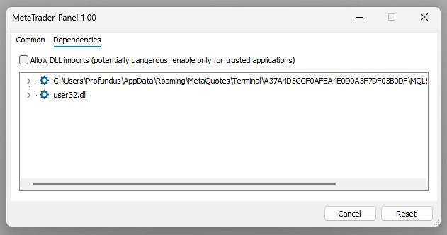
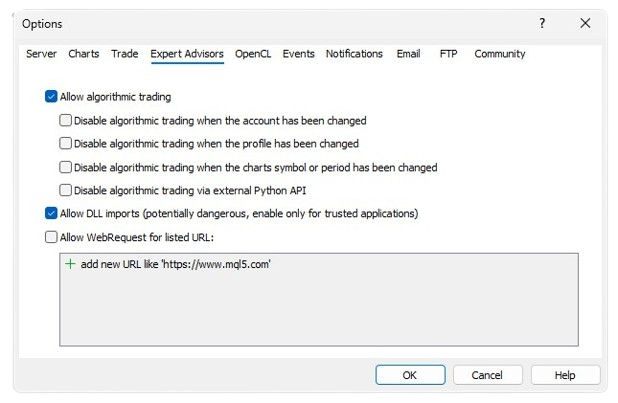

<a href="../.." title="MetaTrader-Panel" aria-label="MetaTrader-Panel">
<svg class="mobile_only" width="60" height="60" viewbox="0 0 40 40" xmlns="http://www.w3.org/2000/svg">
	<circle cx="20" cy="20" fill="none" r="12" stroke="#1750AC" stroke-width="3">
	   <animate attributeName="r" from="8" to="20" dur="1.5s" begin="0s" repeatCount="indefinite"/>
	   <animate attributeName="opacity" from="1" to="0" dur="1.5s" begin="0s" repeatCount="indefinite"/>
	</circle>
	<circle cx="20" cy="20" fill="#3373C4" r="13"/>
	<circle cx="20" cy="20" fill="#5494DA" r="12"/>
	<circle cx="20" cy="20" fill="#1750AC" r="8"/>
	<circle cx="20" cy="20" fill="#F5F5F5" r="7"/>
</svg>
</a>

# ALLGEMEINE FRAGEN

### Verschiedenes	 	 

??? note "Wasc ist eigentlich eine VPS und warum ist sie sinnvoll?"

    Lorem ipsum dolor sit amet, consectetur adipiscing elit. Nulla et euismod
    nulla. Curabitur feugiat, tortor non consequat finibus, justo purus auctor
    massa, nec semper lorem quam in massa.
	{ align=left }

??? note "Ich trade viel über mein Handy, macht MetaTrader-Panel Sinn für mich?"

    Lorem ipsum dolor sit amet, consectetur adipiscing elit. Nulla et euismod
    nulla. Curabitur feugiat, tortor non consequat finibus, justo purus auctor
    massa, nec semper lorem quam in massa.	 
	 
	 

??? note "Warum nutzt MetaTrader-Panel externe Bibliotheken?"

    Lorem ipsum dolor sit amet, consectetur adipiscing elit. Nulla et euismod
    nulla. Curabitur feugiat, tortor non consequat finibus, justo purus auctor
    massa, nec semper lorem quam in massa.	 
	 
	 

??? note "Wie stelle ich das Benutzer-Interface auf Deutsch um?"

    Lorem ipsum dolor sit amet, consectetur adipiscing elit. Nulla et euismod
    nulla. Curabitur feugiat, tortor non consequat finibus, justo purus auctor
    massa, nec semper lorem quam in massa.
 
### Installation

??? note "Kann ich MetaTrader-Panel in Verbindung mit einer VPS nutzen?"

    Lorem ipsum dolor sit amet, consectetur adipiscing elit. Nulla et euismod
    nulla. Curabitur feugiat, tortor non consequat finibus, justo purus auctor
    massa, nec semper lorem quam in massa.	 
	
??? note "Was bedeutet mobile Installation?"

    Lorem ipsum dolor sit amet, consectetur adipiscing elit. Nulla et euismod
    nulla. Curabitur feugiat, tortor non consequat finibus, justo purus auctor
    massa, nec semper lorem quam in massa.

??? note "Kann ich MetaTrader-Panel auch mit MT4 nutzen?"

    Lorem ipsum dolor sit amet, consectetur adipiscing elit. Nulla et euismod
    nulla. Curabitur feugiat, tortor non consequat finibus, justo purus auctor
    massa, nec semper lorem quam in massa.	 
	 
??? note "Kann ich MetaTrader-Panel auf einem Rechner mit iOS / Linux installieren?"

    Lorem ipsum dolor sit amet, consectetur adipiscing elit. Nulla et euismod
    nulla. Curabitur feugiat, tortor non consequat finibus, justo purus auctor
    massa, nec semper lorem quam in massa.	 
	 

 	 
### Lizenz

??? note "Hat die kostenfreie Lizenz Beschränkungen?"

    Lorem ipsum dolor sit amet, consectetur adipiscing elit. Nulla et euismod
    nulla. Curabitur feugiat, tortor non consequat finibus, justo purus auctor
    massa, nec semper lorem quam in massa.

??? note "Wie lange ist eine Lizenz gültig?"

    Lorem ipsum dolor sit amet, consectetur adipiscing elit. Nulla et euismod
    nulla. Curabitur feugiat, tortor non consequat finibus, justo purus auctor
    massa, nec semper lorem quam in massa.	 
	 
	 

??? note "Kann ich die Lizenz Kosten steuerlich absetzen?"

    Lorem ipsum dolor sit amet, consectetur adipiscing elit. Nulla et euismod
    nulla. Curabitur feugiat, tortor non consequat finibus, justo purus auctor
    massa, nec semper lorem quam in massa.	 
	 
	 

??? note "Ist die Lizenz übertragbar?"

    Lorem ipsum dolor sit amet, consectetur adipiscing elit. Nulla et euismod
    nulla. Curabitur feugiat, tortor non consequat finibus, justo purus auctor
    massa, nec semper lorem quam in massa.	
	
??? note "Für welche Instrumente sendet Jeannie Signale?"

    Lorem ipsum dolor sit amet, consectetur adipiscing elit. Nulla et euismod
    nulla. Curabitur feugiat, tortor non consequat finibus, justo purus auctor
    massa, nec semper lorem quam in massa.
	
 	
### MT5 Berechtigungen	 	 

??? note "Warum kann ich den MetaTrader-Panel EA nicht auf den Chart ziehen?"

	

    
	Lorem ipsum dolor sit amet, consectetur adipiscing elit. Nulla et euismod
    nulla. Curabitur feugiat, tortor non consequat finibus, justo purus auctor
    massa, nec semper lorem quam in massa.  
	
	<picture >
            
    <picture>
		  
	

	

	blabla
	

??? note "Der MetaTrader-Panel EA startet, aber ich kann nicht traden"

    Lorem ipsum dolor sit amet, consectetur adipiscing elit. Nulla et euismod
    nulla. Curabitur feugiat, tortor non consequat finibus, justo purus auctor
    massa, nec semper lorem quam in massa.	 
	
	{ align=left }
	 
??? note "Kann ich das Timframe wechseln während MetaTrader-Panel läuft?"

    Lorem ipsum dolor sit amet, consectetur adipiscing elit. Nulla et euismod
    nulla. Curabitur feugiat, tortor non consequat finibus, justo purus auctor
    massa, nec semper lorem quam in massa.	 
	
??? note "Warum schliesst sich MetaTrader-Panel, wenn ich das Konto wechsle?"

    Lorem ipsum dolor sit amet, consectetur adipiscing elit. Nulla et euismod
    nulla. Curabitur feugiat, tortor non consequat finibus, justo purus auctor
    massa, nec semper lorem quam in massa.	 
	 
??? note "Kann ich das Symbol wechseln während MetaTrader-Panel läuft?"

    Lorem ipsum dolor sit amet, consectetur adipiscing elit. Nulla et euismod
    nulla. Curabitur feugiat, tortor non consequat finibus, justo purus auctor
    massa, nec semper lorem quam in massa.	 	 

??? note "Muss ich Web-Requests setzen?"

    Lorem ipsum dolor sit amet, consectetur adipiscing elit. Nulla et euismod
    nulla. Curabitur feugiat, tortor non consequat finibus, justo purus auctor
    massa, nec semper lorem quam in massa.

 

 
 	
 
 
 
