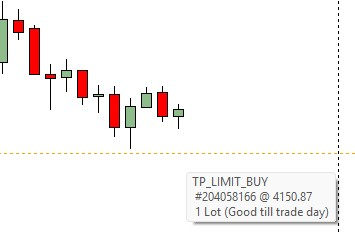
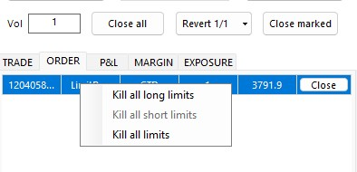

<a href="../.." title="MetaTrader-Panel" aria-label="MetaTrader-Panel">
<svg class="mobile_only" width="60" height="60" viewbox="0 0 40 40" xmlns="http://www.w3.org/2000/svg">
  <circle cx="20" cy="20" fill="none" r="12" stroke="#1750AC" stroke-width="3">
	<animate attributeName="r" from="8" to="20" dur="1.5s" begin="0s" repeatCount="indefinite"/>
	<animate attributeName="opacity" from="1" to="0" dur="1.5s" begin="0s" repeatCount="indefinite"/>
  </circle>
  <circle cx="20" cy="20" fill="#3373C4" r="13"/>
  <circle cx="20" cy="20" fill="#5494DA" r="12"/>
  <circle cx="20" cy="20" fill="#1750AC" r="8"/>
  <circle cx="20" cy="20" fill="#F5F5F5" r="7"/>
</svg>
</a>

# ORDER FRAGEN

### Allgemein	 	 

??? note "Warum überhaupt Orders verwenden?"

    Während vor 20 Jahren der  Wertpapierhandel noch im Wesentlichen telefon-basiert gewesen war, 
	geht es heutzutage um Millisekunden. Wie groß die Unterschiede wirklich sind zeigt dir die nachfolgende Übrsicht.  
	
	| METHODE |                             |    DAUER                  |
	| :----------     | :-------------------------- |:---------------------------|
	| __`MetaTrader-Panel Limit Order`__     | |2-5 Millisekunden|
	| __`Market Order MT5`__ | |3-5 Sekunden  |
	| __`Telefonische Order`__  ||7-15 Sekunden |

    
	
??? note "Was ist eine GTC und was ein GTD Order?"

    __`GTC`__ ist die Abkürzung für 'Good until canceled' und definiert eine Limit-Order die solange aktiv bleibt,
	bis sie entweder ausgeführt ist oder der Benutzer die Order streicht.  
	__`GTD`__ ist die Abkürzung für 'Good until today' und definiert eine Limit-Order die, falls der Limit-Preis nicht erreicht wird, 
	zum Ende des Handelstages verfällt.  
	
	__Wir empfehlen die Einstellung__ __`GTD`__ __zu verwenden.__
	
	
	
### Setzen, ändern und löschen von Orders
??? note "Wie setze ich eine Order?"

    Du kannst blitzschnell eine Limit Order setzen, indem du einen Doppelklick im Chart ausführst.  
	Für eine long Limit Order doppelklickst du unter den aktuellen Kurs, für eine short Order über den aktuellen Kurs.
	
	| ORDER TYP            |                             |    AKTION                  |
	| :----------     | :-------------------------- |:---------------------------|
	| __`Long Order`__     |    							|Doppelklick unter dem aktuellen Kurs   					 |
	| __`Short Order`__     |    							|Doppelklick über dem aktuellen Kurs   					 |
	
??? note "Kann ich aus dem Tick-Chart auch Orders setzen?"

    Aber natürlich. Es gilt das gleiche Prinzip wie beim setzen einer Limit Order im MT5 Chart.
	
??? note "Warum kann ich keine Order setzen?"
	
	Dafür kann es die folgenden Gründe geben:  
	
    1. Es findet aktuell kein Handel statt
	2. Die Option __`Algoritmisches Handeln erlauben`__ in den MT5 Optionen ist nicht gesetzt.
	3. Der Abstand vom Limit Preis zum aktuellen Kurs ist kleiner als der Spread des Instrumentes.
	3. Das MetaTradr-Panel Interface zeigt ein geschlossenes Schloss an.
	4. Dein Broker erlaubt momentan keine neuen Positionen für das Instrument.
	 
	 

??? note "Wie ändere ich eine Order?"

    Du kannst blitzschnell dein Limit ändern, indem du die Limit Order einfach mit der Maus auf den neuen Wert verschiebst.  
	
       
	
	:material-lightbulb-on:{ .lightbulb }  Tipp: Du kannst auch mehrere Orders, die du vorher im Chart ausgewählt hast, auf einmal ändern.	
	 

??? note "Wie lösche ich eine Order?"
	
	Mit einem Rechtsklick im Order Tab kannst du entweder das ausgewähle Limit oder alle gesetzten Limits löschen.  
	
      
	
	:material-lightbulb-on:{ .lightbulb }  Tipp: Du kannst eine Order auch löschen indem du einfach die Limit Linie im MT5 Chart löschst.
 

 
 	
 
 
 