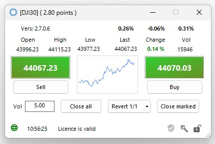
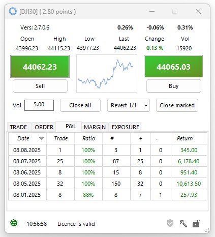

<a href="../.." title="MetaTrader-Panel" aria-label="MetaTrader-Panel">
<svg class="mobile_only" width="60" height="60" viewbox="0 0 40 40" xmlns="http://www.w3.org/2000/svg">
  <circle cx="20" cy="20" fill="none" r="12" stroke="#1750AC" stroke-width="3">
	<animate attributeName="r" from="8" to="20" dur="1.5s" begin="0s" repeatCount="indefinite"/>
	<animate attributeName="opacity" from="1" to="0" dur="1.5s" begin="0s" repeatCount="indefinite"/>
  </circle>
  <circle cx="20" cy="20" fill="#3373C4" r="13"/>
  <circle cx="20" cy="20" fill="#5494DA" r="12"/>
  <circle cx="20" cy="20" fill="#1750AC" r="8"/>
  <circle cx="20" cy="20" fill="#F5F5F5" r="7"/>
</svg>
</a>

# INTERFACE FRAGEN 

### Verschiedenes	 	 
??? note "Warum passiert nichts, wenn ich auf kaufen oder verkaufen klicke?" 

	
	<picture >
		
    <picture>  
	
	Überprüfe, ob das __`Schloss`__  geöffnet ist. Is es geschlossen, klicke es mit der Maus an oder rufe den Tastatur Kurzbefehl __`Strg + L`__ auf.  
	
	:material-lightbulb-on:{ .lightbulb }  Tipp: Das Schloss ist eine Schutzeinrichtung, damit du nicht unbeabsichtigt einen Trade auslöst.
	
??? note "Kann ich die Größe des Interfaces ändern?"
	
	Du kannst die Höhe des Interfaces mit der Maus stufenlos andern. 
	
      
	Minimal Größe  
	
	  
	Benutzerdefinierte Größe 
	 
	:material-lightbulb-on:{ .lightbulb }  Tipp: Mit einem Doppelklick in die Statuszeile kannst du das Interface blitzschnell verkleinern..
	
??? note "Warum gibt es mehr als einen Close Button?"

	Damit du immer blitzschnell auf eine Situation im Markt reagieren kannst, verfügt MetaTrader-Panel über spezialisierte close buttons.
	Nachfolgende Übersicht zeigt ihre Verwendung.
	
    | Button            |   Verwendung                         |
	| :----------     | :----------------------------------- |
	| __`Close all`__    |Schliesst alle Positionen des Instrumentes, die nicht als [__`Longrunner`__](pl-faq.md) markiert sind. |
	| __`Close marked`__   |Schliesst alle __selektierten__ Positionen des Instrumentes, die nicht als [__`Longrunner`__](pl-faq.md) markiert sind. |
	| __`Close`__      |Schließt eine einzelne Position oder löst einen Teilverkauf der Position aus.  |
	 

??? note "Was hat es mit dem Revert Button auf sich?"
	
    Der __`Revert Button`__ erlaubt es dir blitzschnell eine Position zu schließen und eine Position in die Gegenrichtung zu eröffnen.
	Dabei kannst du entscheiden, ob die gleiche Positionsgröße oder nur eine Teilmenge verwendet werden soll. 
	Eine ausführliche Anleitung zum Gebrauch des __`Revert Button`__ findest du [__hier__](pl-faq.md)

	
??? note "Wie schalte ich von der Profit & Loss Anzeige auf den Mini Chart?"

    Mit einem Doppelklick auf den Mini Chart wechselst du zur Profit & Loss Anzeige oder wieder rurück.
	Du kannst natürlich auch den Tastaturkurzbefehl   __`Strg +  C`__  benutzen.
	
??? note "Wie zeige ich die Eigenschaften einer Position an?"

	Mit einem Doppelklick auf die Position, rufst du ganz einfach den Eigenschaften Dialog auf.  
	

	

	<picture >
            
    <picture>  

	<picture >
            
    <picture>
		  
	

	
??? note "Wie kann ich die Handelszeit für ein Instrument anzeigen?"

	Das haben wir schon für dich erledigt.
	
	<picture >
            
    <picture>   
	Die Anzeige ist aufgebaut wie ein Timer. Steht die Anzeige auf __`00:00:00`__ ist Handelsschluss.	Um dich zusätzlich zu unterstützen, bekommst  die   __`letzten 15 Minuten`__  vor Handelsschluss zusätzliche Warnungen angezeigt.

		  

	
??? note "Wie kann ich ein detailiertes Handeslsergebnis für einen Tag ansehen?"

    Das erklären wir [__hier__](pl-faq.md)		
	
??? note "Was bedeuetet Docked?"

    Du kannst das MetaTrader-Panel Interface entweder im Hauptfenster von MT5 laufen lassen, oder außerhalb; ganz wie du möchtest.
	Im __`Docked Modus`__ ist das Interface Teil von MT5, ansonsten kannst du das Interface frei auf deinem Bildschirme positionieren.

??? note "Was bedeueten die verschiedenen Icons in der Statuszeile?"

    Die Bedeutung der unterschiedlichen Icons und ihre Verwendung erklären wir [__hier__](pl-faq.md).

 
### Positionsgröße	 	 
??? note "Muss ich Punkt oder Komma als Dezimaltrenner verwenden?"

    Du kannst beides nehmen. Deine Eingabe wird automatisch geprüft und das Dezimalzeichen gegebenenfalls ersetzt.

??? note "Und wenn ich mich bei der Eingabe vertippe?"

    Solltest du einen ungültigen Wert eingeben, wird das erkannt und stattdessen die kleinste mögliche Lotsize des Instrumentes vorgeschlagen.	 

??? note "Wie ermittle ich die Mindestpositionsgröße für eine Instrument?"

    Gib einfach eine __`0`__ ein, der Algorithmus ersetzt dann diesen Wert mit der kleinsten Lotsize, die für das gewählte Instrument möglich ist.	.	 
	 	 

??? note "Kann ich eine maximale Positionsgröße setzen?"

    Ja klar. Um dich vor sogenannten __`fat finger trades`__ zu schützen kannst du in den MetaTrader-Panel Optionen, unabhängig von den Vorgaben deines Brokers, sowohl eine Warnschwelle als auch eine maximale Positionsgröße setzen.
	Weitere Informationen zum Thema findest du [__hier__](pl-faq.md)

 

 
 	
 
 
 
