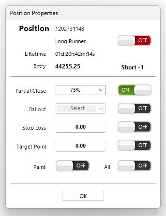

<a href="../.." title="MetaTrader-Panel" aria-label="MetaTrader-Panel">
<svg class="mobile_only" width="60" height="60" viewbox="0 0 40 40" xmlns="http://www.w3.org/2000/svg">
  <circle cx="20" cy="20" fill="none" r="12" stroke="#1750AC" stroke-width="3">
	<animate attributeName="r" from="8" to="20" dur="1.5s" begin="0s" repeatCount="indefinite"/>
	<animate attributeName="opacity" from="1" to="0" dur="1.5s" begin="0s" repeatCount="indefinite"/>
  </circle>
  <circle cx="20" cy="20" fill="#3373C4" r="13"/>
  <circle cx="20" cy="20" fill="#5494DA" r="12"/>
  <circle cx="20" cy="20" fill="#1750AC" r="8"/>
  <circle cx="20" cy="20" fill="#F5F5F5" r="7"/>
</svg>
</a>

<figure markdown="span">
  { width="75" }
  <figcaption>Almost done...</figcaption>
</figure>

# STOP FRAGEN

## Allgemein

??? note "Was genau sind die Unterschiede der verschiedenen Stops?"
    	
	

	
	MetaTrader-Panel stellt dir spezialisierte Stops zur Verfügung die alle im <a href="../../features/stops#stealth-modus"><strong>Stealth Modus</strong></a> arbeiten.
	Nachfolgend findest du eine Übersicht, welchen Stop du wofür verwendest. (1)
	

    | TYP            | VERWENDUNG                           | UNSICHTBAR                          |
	| :----------     | :----------------------------------- |:-----------------------------------: |
	| `STOP LOSS`     | Standard Verlustbegrenzung  |:material-check:  |
	| `TARGET POINT`       | Standard Gewinnsicherung |:material-check:  |
	| `BAILOUT`    		   | Schnelles closen schlechter Einstiege |:material-check:  |
	| `GROUP STOP`         | Verlustbegrenzung für alle Positionen eines Instrumentes |:material-check: |
	| `GUARDIAN ANGEL`     | Verlustbegrenzung für alle Positionen über alle Instrumente |:material-check:  |
	| `LONGRUNNER`         | Definiert Ausnahmeregeln |:material-check:  |
	
	

	
	1.  I'm an annotation!
	
	
	
Detailierte Informationen zu den unterschiedlichen Stops findest du <a href="../../features/stops/"><strong>hier</strong></a>

    
??? note "Was ist der Stealth Modus?"

    
Im Stealth Modus sind deine Stops deinem Broker gegenüber verborgen und nur du kannst sie sehen. Mehr Informationen zum Steahlt Modus und warum er so wichtig ist, findest du <a href="../../features/stops/"><strong>hier</strong></a>

	
		  
	
??? note "Ich will einen Stop setzen, wie mache ich das?"

	Mit einem Doppelklick auf die Position deren Eigenschaften du ändern möchtest, rufst du ganz einfach den Eigenschaften Dialog auf.  
	
	
    :material-lightbulb-on:{ .lightbulb }  Tipp: Achte darauf, dass das Schloss geöffnet ist

	

	<picture >
            
    <picture>  
	
	Im Eigenschaften Dialog kannst du nun deine Stops wie gewünscht setzen.
    

	<picture >
            
    <picture>
		  
	

	
Weitere Informationen zu den unterschiedlichen Stops findest du <a href="../../features/stops/"><strong>hier</strong></a>

??? note "Kann ich schon vor Eröffnung einer Position Stops festlegen?"
	
	Ja klar, das ist kein Problem. In den MetaTrader-Panel Einstellungen kannst du für das jeweilige Instrument sowohl einen Stop Loss als auch Target Point Wert festlegen, die ab Eröffnung der Position sofort gültig sind.
	
	

	<picture >
            
    <picture>
    
	
Weitere Informationen zu vordefinierten Stops findest du <a href="../../features/stops/"><strong>hier</strong></a>

		  
	

 
     
 	
## Stop Loss

??? note "Wie setze ich ein Stop Loss?"
	
	Ein Doppelklick auf eine Position im Interface zeigt dir ihre Eigenschaften an.  
	
      
	
??? note "Kann mein Broker mein Stop Loss sehen?"

    Nein keine Sorge. MetaTrader-Panel arbeitet im sogenannten __`Steahlth Modus`__.
	Alle Stops sind dabei für deinen Broker verborgen und nur du weißt wo sie liegen.
	
??? note "Wie sichere ich eine Position am schnellsten, sobald sie ins Geld läuft?"

    Einfach bei gedrückter __`Strg Taste`__  auf die Position im Interface doppelklicken
	und es wird ein Stop Loss im Geld gesetzt. Wie weit im Geld der Stop Loss gesetzt wird, 
	kannst du du in den Optionen des Instrumentes individuell festlegen.

??? note "Wie ändere ich ein Stop Loss am schnellsten?"

    Die mit Abstand schnellste Art dein Stop Loss zu ändern ist es im MT5 Chart einfach dahin zu ziehen wo du es haben möchtest.
	Du kannst das Stop Loss natürlich auch über die Positions Eigenschaften ändern.

??? note "Ich möchte für alle Positionen das gleich Stop Loss setzen"

    Kein Problem, aktiviere einfach in den Positions Eigenschaften den Schalter __`All`__ .	Der Algorithmus übernimmt dann für alle offenen Position für die das gleiche Stop Loss möglich ist den Vorschlagswert.
	Positionen bei denen der Vorschlagswert zu einem sofortigen Schließen der Position führen würde, werden ignoriert.

??? note "Kann ich das Stop Loss im Chart anzeigen?"

    Natürlich. Aktiviere einfach in den Positions Eigenschaften den Schalter __`Paint`__ .	 
	
??? note "Kann ich das Stop Loss mit einem Teilverkauf kombinieren?"

    Kein Problem für MetaTrader-Panel. Aktiviere einfach den __`Teilverkauf`__ mit dem gewünschten Prozentsatz. Zusätzlich setzt du dein Stop Loss wie gewohnt.	 .	
 
## Target Point	 	 

??? note "Wie setze ich einen Target Point?"

    Ein Doppelklick auf eine Position im Interface zeigt dir ihre Eigenschaften an.  
	
      .

??? note "Kann mein Broker meinen Target Point sehen?"

    Nein keine Sorge. MetaTrader-Panel arbeitet im sogenannten __`Steahlth Modus`__.
	Alle Stops sind dabei für deinen Broker verborgen und nur du weißt wo sie liegen.
	 
	 
??? note "Wie ändere ich einen Target Point am schnellsten?"

    Wenn du den Target Point im MT5 Chart hast zeichnen lassen, kannst du die Linie einfach mit der Maus auf den neuen Wert verschieben.
	 
??? note "Ich möchte für alle Positionen das gleich Stop Loss setzen"

    Kein Problem, aktiviere einfach in den Positions Eigenschaften den Schalter __`All`__ .	Der Algorithmus übernimmt dann für alle offenen Position für die das gleiche Stop Loss möglich ist den Vorschlagswert.
	Positionen bei denen der Vorschlagswert zu einem sofortigen Schließen der Position führen würde, werden ignoriert.
	
??? note "Kann ich den Target Point im Chart anzeigen?"

    Aktiviere in den Positions Eigenschaften einfach den Schalter __`Paint`__  und dein Target Point wird im Chart gezeichnet.	
	
??? note "Kann ich den Target Point mit einem Teilverkauf kombinieren?"

    Kein Problem für MetaTrader-Panel. Aktiviere einfach den __`Teilverkauf`__ mit dem gewünschten Prozentsatz. Zusätzlich setzt du deinen Target Point wie gewohnt.	 .			
 
## Bailout

??? note "Was ist eigentlich ein Bailout und wie nutze ich ihn?"

      ..

??? note "Wie aktiviere ich den Bailout?"

      .
	 

??? note "Warum kann ich den Bailout nicht aktivieren?"

    Der Bailout kann nur aktiviert werden für Position die aus dem Geld sind.
    Ist	deine Position profitabel, gibt es keinen Grund den Bailout zu nutzen.

??? note "Kann ich den Bailout gleichzeitig für alle offenen Positionen setzen?"

    Nein, das würde keinen Sinn ergeben. Der Bailout muss gezielt für jede Position aktiviert werden..
 

## Group Stop 	 

??? note "Was ist eigentlich ein Group Stop?"

    Du kannst dir einen Group Stop ähnlich einem Stop Loss vorstellen nur dass der Group Stop alle Positionen eines Instrumentes berücksichtigt.  
	Mehr Informationen zu Stops findest du [__hier__](../features/stops.md)

	
	
??? note "Werden alle Positionen geshlossen, falls der Group Stop ausgelöst wird?"

    Nein, wird der Group Stop ausgelöst, sucht er die Position des Instrumentes mit dem größten Verlust und schließt diese.
	Dieser Vorgang wiederholt sich jedes mal, wenn die festgelegte Verlustgrenze überschritten wird.	
	 
??? note "Kann ich den Group Stop in Verbindung mit einem Positions Stop Loss nutzen?"

    Ja selbstverständlich, so bist du doppelt abgesichert.
	 
??? note "Kann ich den Group Stop in Verbindung mit einem Positions Target Point nutzen?"

    Na klar, es gilt das gleiche Prinzip wie bei der Kombination mit einem Stop Loss.
	 	 
 
## Guardian Angel

??? note "Was ist die Schutzengel Funktion und wie nutze ich sie?"

    Lorem ipsum dolor sit amet, consectetur adipiscing elit. Nulla et euismod
    nulla. Curabitur feugiat, tortor non consequat finibus, justo purus auctor
    massa, nec semper lorem quam in massa.

??? note "Werden gegebenfalls alle Positionen geschlossen?"

    Nein, wird der Schutzengel Stop ausgelöst, sucht er über alle Instrumente für die du offene Position hast, die mit dem höchsten Verlust und schließt nur diese.
	Dieser Vorgang wiederholt sich jedes mal wenn die festgelegte Verlustgrenze überschritten wird.		 

??? note "Kann ich den Schutzengel in Verbindung mit einem Group Stop nutzen?"

    Ja selbstverständlich, alle Stops bauen aufeinander auf und ergänzen sich.
	Mehr Informationen dazu wie die Stops ineinder greifen, findest du [__hier__](../features/stops.md)

??? note "Kann ich den Schutzengel in Verbindung mit Stop Loss oder Target Point einer Position nutzen?"

    Ja klar, kein Problem, alle Stops sind miteinander kombinierbar.
	[__Hier__](../features/stops.md) erklären wir, die unterschiedlichen Stops im Detail.
		
 	
## Longrunner

??? note "Was ist eigentlich ein Longrunner?"

    Lorem ipsum dolor sit amet, consectetur adipiscing elit. Nulla et euismod
    nulla. Curabitur feugiat, tortor non consequat finibus, justo purus auctor
    massa, nec semper lorem quam in massa.

??? note "Wie verhält sich ein Longrunner genau?"

    Lorem ipsum dolor sit amet, consectetur adipiscing elit. Nulla et euismod
    nulla. Curabitur feugiat, tortor non consequat finibus, justo purus auctor
    massa, nec semper lorem quam in massa.	 
	 
	
 
 
 	
 
 
 
