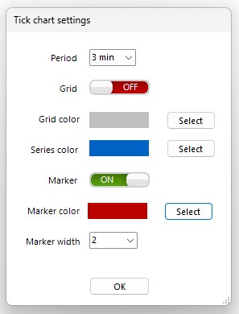

<a href="../.." title="MetaTrader-Panel" aria-label="MetaTrader-Panel">
<svg class="mobile_only" width="60" height="60" viewbox="0 0 40 40" xmlns="http://www.w3.org/2000/svg">
  <circle cx="20" cy="20" fill="none" r="12" stroke="#1750AC" stroke-width="3">
	<animate attributeName="r" from="8" to="20" dur="1.5s" begin="0s" repeatCount="indefinite"/>
	<animate attributeName="opacity" from="1" to="0" dur="1.5s" begin="0s" repeatCount="indefinite"/>
  </circle>
  <circle cx="20" cy="20" fill="#3373C4" r="13"/>
  <circle cx="20" cy="20" fill="#5494DA" r="12"/>
  <circle cx="20" cy="20" fill="#1750AC" r="8"/>
  <circle cx="20" cy="20" fill="#F5F5F5" r="7"/>
</svg>
</a>

# TICK CHART FRAGEN

### Allgemein	 	 

??? note "Wird Bid oder Ask angezeigt?"

    Das ist deine Entscheidung. Je nachdem was du für deine Trades nutzen willst, aktivierst entweder Bid oder Ask.
	
??? note "Sind Timeframes verfügbar?"

    Ja klar, du kannst aus Intervallen zwischen 1 Minute bis 60 Minuten wählen.

??? note "Wie speichere ich die Tick Chart Position?"

    Das erledigen wir für dich. Die Position des Tick Charts wird automatisch gespeichert.

??? note "Kann ich meine eigenen EInstellungen setzen?"

    Selbstverständlich. Konfiguriere den Tick Chart ganz wie du willst, die Einstellungen dazu findest du in den Tick Chart Einstellungen.
	Wenn du den Tick Chart öffnest werden deine Einstellungen automatisch geladen.  
	
	   
	
	:material-lightbulb-on:{ .lightbulb }  Tipp: Die Einstellungen öffnest du durch einen klick auf den Schraubenschlüssel.	

??? note "Kann ich eine Order setzen?"

    Selbstverständlich kannst du eine Order setzen. Wie das genau geht, wie du sie änderst oder löschst erklären wir in den Order Fragen weiter unten.

??? note "Kann ich ein Stop Loss setzen?"

    Natürlich kannst du auch ein Stop Loss für eine offene Position setzen. Wie du das machst und wie du den Stop änderst, erklären wir in den Stop Loss Fragen weiter unten

??? note "Kann ich einen Target Point setzen?"

    Im Sekunden Trading gilt mehr als bei jeder anderen Art zu traden die alte Weisheit __`"Verluste begrenzen und Profite laufen lasssen"`__. 
	Wenn du aktiv im Tick Chart tradest solltest du keinen Target Punkt benötigen.
	
 
	
### Setzen, ändern und löschen von Orders
??? note "Wie setze ich eine Order?"

    Du kannst blitzschnell eine Limit Order setzen, indem du einen Doppelklick im Chart ausführst.  
	Für eine long Limit Order doppelklickst du unter den aktuellen Kurs, für eine short Order über den aktuellen Kurs.
	
	| ORDER TYP            |                             |    AKTION                  |
	| :----------     | :-------------------------- |:---------------------------|
	| __`Long Order`__     |    							|Doppelklick unter dem aktuellen Kurs   					 |
	| __`Short Order`__     |    							|Doppelklick über dem aktuellen Kurs   					 |

??? note "Wie ändere ich eine Order?"

    Am schnellsten änderst du dein Limit, indem du die Limit Order einfach mit der Maus auf den neuen Wert verschiebst. 
	
??? note "Wie lösche ich eine Order?"

    Mit einem Rechtsklick im Chart kannst du das ausgewähle Limit löschen.  	
	
??? note "Ich kann keine Order setzen"

	Dafür kann es die folgenden Gründe geben:  
	
    1. Es findet aktuell kein Handel statt
	2. Die Option __`Algoritmisches Handeln erlauben`__ in den MT5 Optionen ist nicht gesetzt.
	3. Der Abstand vom Limit preis zum aktuellen Kurs ist kleiner als der Spread des Instrumentes.
	3. Das MetaTrader-Panel Interface zeigt ein geschlossenes Schloss an.
	4. Dein Broker erlaubt momentan keine neuen Positionen für das Instrument.
	
 

### Setzen, ändern und löschen eines Stop Loss
??? note "Wie setze ich ein Stop Loss?"

    Einfach bei gedrückter __`Strg Taste`__  auf die Position im Interface doppelklicken
	und es wird ein Stop Loss im Geld gesetzt. Wie weit im Geld der Stop Loss gesetzt wird, 
	kannst du du in den Optionen des Instrumentes individuell festlegen.

	
??? note "Wie ändere ich ein Stop Loss?"

    Die mit Abstand schnellste Art dein Stop Loss zu ändern ist es die Linie im Tick Chart einfach dahin zu ziehen wo du das neue Stop Loss haben möchtest.
	Du kannst das Stop Loss natürlich auch über die Positions Eigenschaften ändern.
	
??? note "Wie lösche ich ein Stop Loss?"

    Mit einem Rechtsklick im Chart kannst du den ausgewählen Stop löschen.  	.		

??? note "Ich kann kein Stop Loss setzen"

	Dafür kann es die folgenden Gründe geben:  
	
    1. Es findet aktuell kein Handel statt
	2. Die Option __`Algoritmisches Handeln erlauben`__ in den MT5 Optionen ist nicht gesetzt.
	3. Der Abstand vom gewünschten Stop Loss zum aktuellen Kurs ist kleiner als der Spread des Instrumentes.
	3. Das MetaTrader-Panel Interface zeigt ein geschlossenes Schloss an.
	
 
 	
 
 
 