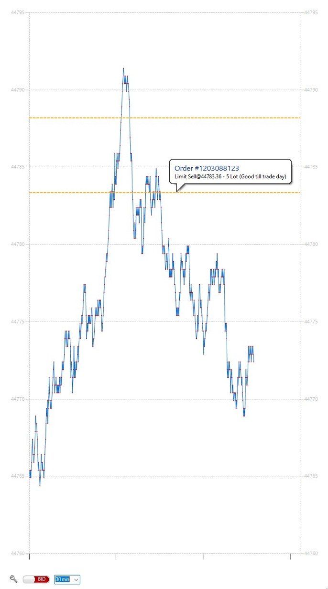

---
hide:
  - navigation
---

	

		

			<svg class="mobile_only" width="60" height="60" viewbox="0 0 40 40" xmlns="http://www.w3.org/2000/svg">
			  <circle cx="20" cy="20" fill="none" r="12" stroke="#1750AC" stroke-width="3">
				<animate attributeName="r" from="8" to="20" dur="1.5s" begin="0s" repeatCount="indefinite"/>
				<animate attributeName="opacity" from="1" to="0" dur="1.5s" begin="0s" repeatCount="indefinite"/>
			  </circle>
			  <circle cx="20" cy="20" fill="#3373C4" r="13"/>
			  <circle cx="20" cy="20" fill="#5494DA" r="12"/>
			  <circle cx="20" cy="20" fill="#1750AC" r="8"/>
			  <circle cx="20" cy="20" fill="#F5F5F5" r="7"/>How we help to achieve better trading results
			  <circle cx="20" cy="20" fill="#F5F5F5" r="7"/>
			</svg>
			<h1 id="refresh-headertext">IHR BROKER IST NICHT IHR FREUND. ER IST IHR HANDELS-PARTNER</h1>
			<h2 id="refresh-subtext" style="color: #333333;">But we are - MetaTrader-Panel was designed with the one idea in mind making CFD trading a fair deal.</h2>
			<h3 style="color: #808080;">Probiere es aus, kostenlos und ohne Risiko.</h3>		
		

		<!--Call to Action-->
		<a href="#" class="button" style="color: #3373C4">Mehr erfahren...</a>
		<!--End Call to Action-->
	

	

		

		<picture >
			
		</picture>
		

	

<!--Main Content Area-->

	<!--Introduction-->
	<section id="about" class="introduction scrollto">

		

			

				

					<h3>SUCCESS</h3>
					<h2 class="section-title">Wie wir dir helfen bessere trading Ergebnisse4 zu erzielen</h2>
					
Lorem ipsum dolor sit amet, consectetur adipiscing elit, sed do
						eiusmod tempor incididunt ut labore et dolore magna aliqua. Ut enim ad minim veniam!

				

			

			

				<!--Icon Block-->
				

					<!--Icon-->
					

						<i class="fa fa-html5 fa-2x" style="color: #5494DA;"></i>
					

					<!--Icon Block Description-->
					

						<h4>HTML5 &amp; CSS3</h4>
						
Has ne tritani atomorum conclusionemque, in dolorum volumus cotidieque eum. At vis choro
							neglegentur iudico

					

				

				<!--End of Icon Block-->

				<!--Icon Block-->
				

					<!--Icon-->
					

						<i class="fa fa-bolt fa-2x" style="color: #5494DA;"></i>
					

					<!--Icon Block Description-->
					

						<h4>Easy to Use</h4>
						
Cu vero ipsum vim, doctus facilisi sea in. Eam ex falli honestatis repudiandae, sit
							detracto mediocrem disputationi

					

				

				<!--End of Icon Block-->

				

			

			

				<!--Icon Block-->
				

					<!--Icon-->
					

						<i class="fa fa-html5 fa-2x" style="color: #5494DA;"></i>
					

					<!--Icon Block Description-->
					

						<h4>HTML5 &amp; CSS3</h4>
						
Has ne tritani atomorum conclusionemque, in dolorum volumus cotidieque eum. At vis choro
							neglegentur iudico

					

				

				<!--End of Icon Block-->

				<!--Icon Block-->
				

					<!--Icon-->
					

						<i class="fa fa-bolt fa-2x" style="color: #5494DA;"></i>
					

					<!--Icon Block Description-->
					

						<h4>Easy to Use</h4>
						
Cu vero ipsum vim, doctus facilisi sea in. Eam ex falli honestatis repudiandae, sit
							detracto mediocrem disputationi

					

				

				<!--End of Icon Block-->

				

			

		

	</section>
	<!--End of Introduction-->

	<!--Content Section-->
	

		

			<!--Content Left Side-->
			

				<!--User Testimonial-->
				<blockquote class="testimonial text-right bigtest">
					<q>Lorem ipsum dolor sit amet, consectetur adipiscing elit, sed do eiusmod tempor incididunt ut
						labore
						et dolore magna aliqua</q>
					<footer>— John Doe, Happy Customer</footer>
				</blockquote>
				<!-- End of Testimonial-->

			

			<!--End Content Left Side-->

			<!--Content of the Right Side-->
			

				

					<h3>BELIEVING</h3>
					<h2 class="section-title">Focusing On What Matters Most</h2>
					
Lorem ipsum dolor sit amet, consectetur adipiscing elit, sed do
						eiusmod tempor incididunt ut labore et dolore magna aliqua. Ut enim ad minim veniam!

				

				
Sed ut perspiciatis unde omnis iste natus error sit voluptatem accusantium doloremque laudantium,
					totam rem aperiam, eaque ipsa quae ab illo inventore veritatis et quasi architecto beatae vitae
					dicta sunt explicabo.
				

				

					Nemo enim ipsam voluptatem quia voluptas sit aspernatur aut odit aut fugit, sed quia
					consequuntur magni dolores eos qui ratione voluptatem sequi nesciunt.
					Neque porro quisquam est, qui dolorem ipsum quia dolor sit amet!
				

				<!-- Just replace the Video ID "UYJ5IjBRlW8" with the ID of your video on YouTube (Found within the URL) -->
				<a href="#" data-videoid="UYJ5IjBRlW8" data-videosite="youtube" class="button video link-lightbox">
					WATCH VIDEO <i class="fa fa-play" aria-hidden="true"></i>
				</a>
			

			<!--End Content Right Side-->

			

				
			

		

	

	<!--End of Content Section-->
	

		
 

	

        
	 
	<!--Pricing Tables-->
        <section id="pricing" class="secondary-color text-center scrollto clearfix ">
            

                

                    <h3>YOUR CHOICE</h3>
                    <h2 id="JumpLink" class="section-title">We have the right package for you</h2>
                

                <!--Pricing Block-->
                

                    

                        <h3>FREE</h3>
                        
The standard version

                        

                            
€0

                            
Lorem ipsum dolor sit amet, consectetur adipiscing elit

                        

                        <ul>
                            <li>5 Downloads</li>
                            <li>2 Extensions</li>
                            <li> </li><li> </li>
                            <li>Forum Support</li>
                            <li>1 year free updates</li>
                        </ul>
                        <a href="#" class="button">BUY TODAY</a>
                    

                

                <!--End Pricing Block-->

                <!--Pricing Block-->
                

                    

                        <h3>STADALONE</h3>
                        
For the whole team

                        

                            
€99

                            
Lorem ipsum dolor sit amet, consectetur adipiscing elit

                        

                        <ul>
                            <li>Unlimited Downloads</li>
                            <li>Unlimited Extensions</li>
                            <li>HD Video Tutorials</li>
                            <li>Chat Support</li>
                            <li>Lifetime free updates</li>
                        </ul>
                        <a href="#" class="button">BUY TODAY</a>
                    

                

                <!--End Pricing Block-->
				
				<!--Pricing Block-->
                

                    

                        <h3>PROFESSIONAL</h3>
                        
For the whole team

                        

                            
€199

                            
Lorem ipsum dolor sit amet, consectetur adipiscing elit

                        

                        <ul>
                            <li>Unlimited Downloads</li>
                            <li>Unlimited Extensions</li>
                            <li>HD Video Tutorials</li>
                            <li>Chat Support</li>
                            <li>Lifetime free updates</li>
                        </ul>
                        <a href="#" class="button">BUY TODAY</a>
                    

                

                <!--End Pricing Block-->

            

        </section>
        <!--End of Pricing Tables-->

	<!--Testimonials-->
	<aside id="testimonials" class="scrollto text-center" data-enllax-ratio=".2">

		

			

				<h3>FEEDBACK</h3>
				<h2 class="section-title">What our customers are saying</h2>
			

			<!--User Testimonial-->
			<blockquote class="col-3 testimonial classic">
				
				<q>Lorem ipsum dolor sit amet, consectetur adipiscing elit, sed do eiusmod tempor incididunt ut
					labore
					et dolore magna aliqua</q>
				<footer>John Doe - Happy Customer</footer>
			</blockquote>
			<!-- End of Testimonial-->

			<!--User Testimonial-->
			<blockquote class="col-3 testimonial classic">
				
				<q>Lorem ipsum dolor sit amet, consectetur adipiscing elit, sed do eiusmod tempor incididunt ut
					labore
					et dolore magna aliqua</q>
				<footer>Roslyn Doe - Happy Customer</footer>
			</blockquote>
			<!-- End of Testimonial-->

			<!--User Testimonial-->
			<blockquote class="col-3 testimonial classic">
				
				<q>Lorem ipsum dolor sit amet, consectetur adipiscing elit, sed do eiusmod tempor incididunt ut
					labore
					et dolore magna aliqua</q>
				<footer>Thomas Doe - Happy Customer</footer>
			</blockquote>
			<!-- End of Testimonial-->

		

	</aside>
	<!--End of Testimonials-->	

	

<!--End Main Content Area-->

   
   