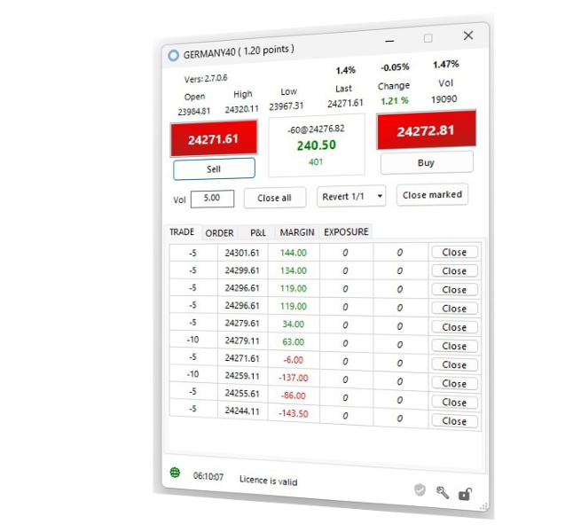
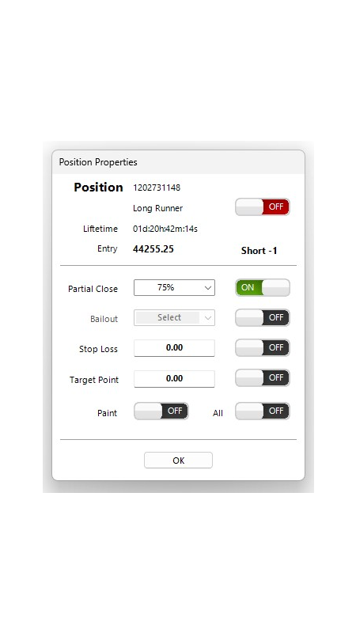

---
hide:
- navigation
---

   

      

         <svg class="mobile_only" width="60" height="60" viewbox="0 0 40 40" xmlns="http://www.w3.org/2000/svg">
            <circle cx="20" cy="20" fill="none" r="12" stroke="#1750AC" stroke-width="3">
               <animate attributeName="r" from="8" to="20" dur="1.5s" begin="0s" repeatCount="indefinite"/>
               <animate attributeName="opacity" from="1" to="0" dur="1.5s" begin="0s" repeatCount="indefinite"/>
            </circle>
            <circle cx="20" cy="20" fill="#3373C4" r="13"/>
            <circle cx="20" cy="20" fill="#5494DA" r="12"/>
            <circle cx="20" cy="20" fill="#1750AC" r="8"/>
            <circle cx="20" cy="20" fill="#F5F5F5" r="7"/>
            How we help to achieve better trading results
            <circle cx="20" cy="20" fill="#F5F5F5" r="7"/>
         </svg>
         <h1 id="refresh-headertext">IHR BROKER IST NICHT IHR FREUND. ER IST IHR HANDELS-PARTNER</h1>
         <h2 id="refresh-subtext" style="color: #333333;">But we are - MetaTrader-Panel was designed with the one idea in mind making CFD trading a fair deal.</h2>
         <h3 style="color: #808080;">Probiere es aus, kostenlos und ohne Risiko.</h3>
      

      <!--Call to Action-->
      <a id="learn-more" href="#" class="button" style="background-color: #5494DA;color:white;">Mehr erfahren <iclass="fa fa-play" aria-hidden="true"></i></a>
      <!--End Call to Action-->
   

   

      

         <picture >
            
         </picture>
      

   

<!--Main Content Area-->

   <!--Introduction-->
   <section id="about" class="introduction ">
      

         

            

               <h3>ERFOLG</h3>
               <h2 class="section-title">Wir helfen bessere Trading Ergebnisse zu erzielen</h2>
               
Durchdachte Features, entwickelt von Profi-Tradern mit jahrzehntelanger Erfahrung, die sich nahtlos in MT5 einfügen
				  und deinen Alltag als Trader leichter machen. Mit ein, zwei Klicks hast du immer die Funktionalität zur Hand, die du gerade brauchst. Kompakt und auf das Wesentliche konzentriert. 
				    
<a href="features/" style="color: #5494DA"><strong>Alle Features ansehen</strong> </a>
              
               

            

         

         

            <!--Icon Block-->
            

               <!--Icon-->
               

                  <i class="fa fa-star fa-2x" style="color: #5494DA;"></i>
               

               <!--Icon Block Description-->
               

                  <h4></i>Wirtschaftsdaten-Wecker</h4>
                  
Keine wichtigen Wirtschaftsdaten mehr verpassen. Einfach 1x Land, Kategorien und Uhrzeit konfigurieren und du wirst immer zuverlässig informiert.
                  

               

            

            <!--End of Icon Block-->
            <!--Icon Block-->
            

               <!--Icon-->
               

                  <i class="fa fa-trophy fa-2x" style="color: #5494DA;"></i>
               

               <!--Icon Block Description-->
               

                  <h4>Teilverkäufe</h4>
                  
Erhöhe deinen Profit und verkaufe eine Position in prozentualen Schritten. Kombiniere die Teilverkäufe mit deinem Stop Loss oder deinem Target Point.
                  

               

            

            <!--End of Icon Block-->
         

         

            <!--Icon Block-->
            

               <!--Icon-->
               

                  <i class="fa fa-flag-checkered fa-2x" style="color: #5494DA;"></i>
               

               <!--Icon Block Description-->
               

                  <h4>Orders per Doppelklick</h4>
                  
Setze, lösche oder ändere eine Order mit einem Klick. Das Geheiminis eines erfolgreichen Einstiegs ist zur rechten Zeit am rechten Platz zu sein.
                  

               

            

            <!--End of Icon Block-->
            <!--Icon Block-->
            

               <!--Icon-->
               

                  <i class="fa fa-rocket fa-2x" style="color: #5494DA;"></i>
               

               <!--Icon Block Description-->
               

                  <h4>Bitzschnell Stops setzen</h4>
                  
Sichere dich mit einem Klick gegen Verluste ab sobald eine Position profitabel wird. Ändere den Stop per Maus-Klick
                  

               

            

            <!--End of Icon Block-->
         

		 

            <!--Icon Block-->
            

               <!--Icon-->
               

                  <i class="fa fa-bolt fa-2x" style="color: #5494DA;"></i>
               

               <!--Icon Block Description-->
               

                  <h4>Tick-Chart Trading</h4>
                  
Ob du Profi-Scalper, Swing-Trader oder Retail-Trader bist, der nur den Moment nutzen will. Du wirst den Tick-Chart lieben.
                  

               

            

            <!--End of Icon Block-->
            <!--Icon Block-->
            

               <!--Icon-->
               

                  <i class="fa fa-bullseye fa-2x" style="color: #5494DA;"></i>
               

               <!--Icon Block Description-->
               

                  <h4>Fibonacci-Power</h4>
                  
Rechne hunderte Fibonacci Marken, über lange Zeitraume und lasse immer nur die anzeigen, die für dein Trading relevant sind.
                  

               

            

            <!--End of Icon Block-->
         

      

   </section>
   <!--End of Introduction-->
   <!--Content Section-->
   

      

         <!--Content Left Side-->
         

            <!--User Testimonial-->
            <blockquote class="testimonial text-right font-18">
               <q class="font-18">Spiele werden von denen gewonnen, die sich auf das Spiel konzentrieren – nicht von denen, die nur die ganze Zeit auf die Anzeigetafel schauen.</q>
               <footer class="font-17">— Warren Buffet —</footer>
            </blockquote>
            <!-- End of Testimonial-->
         

         <!--End Content Left Side-->
         <!--Content of the Right Side-->
         

            

               <h3>FOKUSSIERUNG</h3>
               <h2 class="section-title">Konzentration auf das Wesentliche</h2>
               
Du kümmerst dich um das Spiel  - Und wir kümmern uns um die Anzeigetafel.

            

            
Beim aktiven Trading kommt es heutzutage oft auf Millisekunden an. Die richtige Information zur richtigen Zeit zur Hand zu haben ist entscheidend für deinen Erfolg als Trader. Den Rest erledigen wir für dich.
            

            

               Mit intelligenten Algorithmen, paralleler Datenverarbeitung, leistungsstarken Servern, die auf dem neuesten Stand sind und einem Handels-Pult das du für seine Klarheit und Einfachheit lieben wirst,
			   halten wir dir den Rücken frei.
            

			
<a href="features/" style="color: #5494DA"><strong>Alle Features ansehen</strong> </a>

         

         <!--End Content Right Side-->
         

            
         

      

   

   <!--End of Content Section-->
   

      
 

   

   <!--Pricing Tables-->
   <section id="pricing" class="secondary-color text-center clearfix wow fadeInRight" data-wow-delay="0.1s"">
      

         

            <h3>DEINE ENTSCHEIDUNG</h3>
            <h2 class="section-title" >Wir haben das richtige Angebot für dich</h2>
         

         <!--Pricing Block-->
         

            

               <h3>STARTER</h3>
               
Risikofrei testen

               

                  
€0

                  
Teste MetaTrader-Panel ganz in Ruhe und solange du willst

               

               <ul class="font-17">
                  <li style="color: #333333;">Ideal für Anfänger</li>
                  <li style="color: #333333;">1 Trading Panel</li>
                  <li style="color: #333333;">Keine versteckten Gebühren</li>
                  <li style="color: #333333;">Beschränkt auf Demo-Konten</li>
                  <li style="color: #333333;">Eingeschränkter Support</li>
               </ul>
               <a href="#" class="button" style="background-color: #5494DA;color:white;font-weight: bold;">AUSPROBIEREN</a>
            

         

         <!--End Pricing Block-->
         <!--Pricing Block-->
         

            

               <h3>ADVANCED</h3>
               
Day-Trading

               

                  
€99

                  
Alles was du brauchst um erfolgreich Intraday zu handeln

               

               <ul  class="font-17">
                  <li>Day-Trader / Scalper</li>
                  <li>Unlimierte Panel Anzahl</li>
                  <li>Trading Knowledgebase</li>
                  <li>Inklusiv 1 Jahr Updates</li>
                  <li>Uneingeschränkter Support</li>
               </ul>
               <a href="#" class="button" style="background-color: #5494DA;color:white;font-weight: bold;">JETZT KAUFEN </a>
            

         

         <!--End Pricing Block-->
         <!--Pricing Block-->
         

            

               <h3>PROFESSIONAL</h3>
               
Day-Trader incl. Signale

               

                  
€299

                  
Erhalte zusätzlich Handelssignale unserer AI "Jeannie"

               

               <ul  class="font-17">
                  <li>KI Handels-Signale</li>
                  <li>Unlimierte Panel Anzahl</li>
                  <li>Trading Knowledgebase</li>
                  <li>Inklusiv 1 Jahr Updates</li>
                  <li>Uneingeschränkter Support</li>
               </ul>
               <a href="#" class="button" style="background-color: #5494DA;color:white;font-weight: bold;">JETZT KAUFEN </a>
            

         

         <!--End Pricing Block-->
      

   </section>
   <!--End of Pricing Tables-->
   <!--Testimonials-->
   <aside id="testimonials" class="text-center wow fadeInUp" data-wow-delay="0.1s"">
      

         

            <h3>FEEDBACK</h3>
            <h2 class="section-title">Was unsere Kunden sagen</h2>
         

         <!--User Testimonial-->
         <blockquote  id="ttm-1" class="col-3 testimonial classic">
            <q id="ttmq-1">This is such a wonderful tool shared with generosity. Thank you! Wonderful job. I aim at going full version, using this one for training.</q>
            <footer id="ttmf-1" style="color: gray;" class="font-16">John Doe - Happy Customer</footer>
         </blockquote>
         <!-- End of Testimonial-->
         <!--User Testimonial-->
         <blockquote  id="ttm-2" class="col-3 testimonial classic">
            <q >Lorem ipsum dolor sit amet, consectetur adipiscing elit, sed do eiusmod tempor incididunt ut
            labore
            et dolore magna aliqua</q>
            <footer class="font-16" style="color: gray;">Oma Drusus - Happy Customer</footer>
         </blockquote>
         <!-- End of Testimonial-->
         <!--User Testimonial-->
         <blockquote id="ttm-3" class="col-3 testimonial classic">
            <q >Lorem ipsum dolor sit amet, consectetur adipiscing elit, sed do eiusmod tempor incididunt ut
            labore
            et dolore magna aliqua</q>
            <footer class="font-16" style="color: gray;">Thomas Doe - Happy Customer</footer>
         </blockquote>
         <!-- End of Testimonial-->
      

   </aside>
   <!--End of Testimonials-->	

<!--End Main Content Area-->
