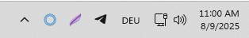
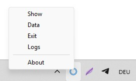
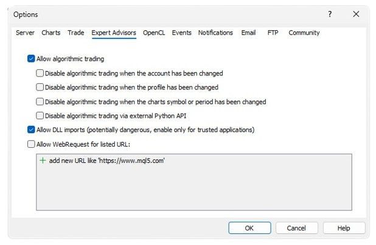

<a href="../.." title="MetaTrader-Panel" aria-label="MetaTrader-Panel">
<svg class="mobile_only" width="60" height="60" viewbox="0 0 40 40" xmlns="http://www.w3.org/2000/svg">
  <circle cx="20" cy="20" fill="none" r="12" stroke="#1750AC" stroke-width="3">
	<animate attributeName="r" from="8" to="20" dur="1.5s" begin="0s" repeatCount="indefinite"/>
	<animate attributeName="opacity" from="1" to="0" dur="1.5s" begin="0s" repeatCount="indefinite"/>
  </circle>
  <circle cx="20" cy="20" fill="#3373C4" r="13"/>
  <circle cx="20" cy="20" fill="#5494DA" r="12"/>
  <circle cx="20" cy="20" fill="#1750AC" r="8"/>
  <circle cx="20" cy="20" fill="#F5F5F5" r="7"/>
</svg>
</a>

# COMMON QUESTIONS

### Miscellaneous	 	 

??? note "How do I change the language of the user interface?"
	
    We only use English for the labeling of control elements.  
	
	__Why are we doing this?__  
	
    Just as in international air travel, English is the standard language used in trading, allowing terms to be described concisely and succinctly. The translation of the terms ‘bid’ and ‘ask’ illustrates how cumbersome other languages can be when it comes to trading terms.
	The English terms are short and self-explanatory,
	
	__Don't worry, we'll help you with tooltips.__  
	
	<picture >
		
    <picture>  
	
	Select the display language for tooltips of your choice in the MetaTrader-Panel options. When hovering your mouse over a control element, a tooltip will appear, often with additional explanations on how to use the respective function. This allows you to familiarize yourself with the international terms while still having an explanation in the selected language at your fingertips.  
	
	
	
??? note "Why the MetaTrader Panel EA is using external libraries?"

    The use of external libraries (known as DLLs) makes MetaTrader Panel more modular, efficient, and easier to maintain. This allows us to process tasks in parallel, giving you a time advantage in your trading, integrate highly specialized control elements, and much more. But the most important reason is that it allows us to keep MetaTrader Panel up to date with the latest technology for you.
	
??? note "What exactly is a VPS and why is it useful?"

    VPS is the abbreviation for Virtual Private Server. This means that you rent a Windows machine from a provider  
	
	
	__What is the advantage of this solution?__   
	
    Nowadays, trading takes place 24 hours a day, 5 days a week, and in the case of cryptocurrencies, 7 days a week. If you are an active trader, you need to monitor your positions 24 hours a day. A VPS is ideal for this purpose due to its reliability, internet connection, and cost-effectiveness. In addition, it offers up to 50 times faster access to your broker's trading server.

	
You can find a guide on how to choose the right VPS <a href="../../features/stops/"><strong>here</strong></a>
	
 

### Installation

??? note "Can I use MetaTrader Panel in conjunction with a VPS?"

    Yes, of course. MetaTrader Panel runs without restrictions on a VPS.	 
	
??? note "What does mobile installation mean??"

    MT5 offers experienced users the option to install the application under any path.
	The __`Mobile Installation`__ feature allows you to install MetaTrader Panel under a custom path.

??? note "Can I also use MetaTrader Panel with MT4?"

    MT4 is the predecessor of MT5 and is now over 20 years old. That is why we have decided not to support MT4.
	 
??? note "Can I install MetaTrader Panel on a computer running iOS/Linux?"

    At present, we only support the Windows version.	
	 

 	 
### Local Server

??? note "What are the tasks of the local server?"

    The local server is the central link between all open panels.
    Its tasks include checking the license, displaying notifications, 
    database management, language management, statistical evaluations of your trades, and much more.
	
??? note "Does the server need to be open all the time?"

    Yes, the server must be open all the time, but you don't have to see it all the time.
	Just minimize the server and it will be placed in the Windows notification area. 
	
	  
	
	And if you ever need it, you can access the command bar by right-clicking.
		
	  
	 

 	
### License

??? note "Does the free license have any restrictions?"

    Nachfolgend findest du eine Tabelle die die Unterschiede der verschiedenen Preis Modelle zeigt.
	
	| MODUL            | FREE OF CHARGE                           | SUBJECT TO CHARGES                          |
	| :----------     | :----------------------------------- :|:-----------------------------------: |
	| __`All Features`__     | Yes  |Yes  |
	| __`Valid`__     | 3 Month  |12 Month  |
	| __`Panels`__       | 2 |Unlimited  |
	| __`Demo Positions`__         | Yes |Yes |
	| __`Real Positions`__         | No |Yes |
	| __`Support`__    		   | Restricted |Full Support  |  
	
	We believe this is a very fair offer. You can test MetaTrader Panel for 3 months with virtually no restrictions and take your time to decide.  
	
	And if you still have questions, we are happy to help at __<info@metatrader-panel.com>__

??? note "How long is a license valid?"

    The free license is valid for 3 months, while the paid version is valid for 12 months.
	 
	 

??? note "Can I deduct the license costs from my taxes?"

    Yes, of course. The annual license fees are considered advertising expenses and are fully tax deductible.
	 
	 

??? note "Is the license transferable?"

    No, the license is linked to your personal trading account and is therefore non-transferable.
	
??? note "For which instruments does Jeannie send signals?"
	
	Jeannie monitors the instruments listed below and sends a signal to open/close the position when the respective criteria are met.  
	
	| INDEX            |                             |                      |
	| :----------     | :-------------------------- |:---------------------------|
	| __`Dow Jones`__     |    							|USA  					 |
	| __`SP500`__         |    							|USA  					     |
	| __`Nasdaq-100`__         |    							|USA  					     |
	| __`Nikkei-225`__         |    							|Japan  					     |
	| __`DAX-40`__         |    |Germany  |
	| __`CAC-40`__         |    |France  |
	| __`EURO STOXX 50`__         |    |Europa  |
	__WÄHRUNG__  
    | __`JPYUSD`__         |    |Global  |
	| __`EURUSD`__         |    |Global  |
	| __`GBPUSD`__         |    |Global  |
	__ROHSTOFF__  
    | __`Gold`__         |    |Global  |
	| __`Silber`__         |    |Global  |
	| __`Brent Öl`__         |    |Global  |		
	__KRYPTO__  	
	| __`BTCUSD`__         |    |Global  |
	| __`ETHUSD`__         |    |Global  |			
	__AKTIE__  
	| __`Apple`__         |    |USA  |
	| __`Amazon`__         |    |USA  |	
	| __`Alphabet`__         |    |USA  |
	| __`Meta`__         |    |USA  |	
	| __`Tesla`__         |    |USA  |		

	
 	
### MT5 Permissions	 	 

??? note "Why can't I drag the MetaTrader Panel EA onto the chart?"

	

    
	Make sure that, as shown in the image, the option __`Allow DLL import`__ is enabled.
	
	<picture >
            
    <picture>
		  
	
  
	:material-lightbulb-on:{ .lightbulb }  Tip: Check the box in the MT5 options.
	
??? note "The MetaTrader Panel EA starts, but I cannot trade"

    Make sure that, as shown in the image, the option “Allow algorithmic trading” is enabled.	 
	
	{ align=left }
	 
??? note "Can I change the timeframe while MetaTrader-Panel is running?"

    But of course. You can choose any available timeframe you want at any time, because the MetaTrader panel works on a tick basis.	 
	
??? note "Why does MetaTrader Panel close when I switch accounts?"

    Each MetaTrader Panel license is linked to exactly one account. If you switch accounts, MetaTrader Panel will close as soon as it detects that there is no valid license for the new account.
	 
??? note "Can I change the symbol while MetaTrader Panel is running?"

    Yes, of course. As soon as you drag a new symbol onto the chart, MetaTrader Panel automatically loads the configuration for the new instrument as well as all open positions and orders.

??? note "Do I need to to set web requests?"

    No, don't worry, you don't have to set any web requests.

 

 
 	
 
 
 
