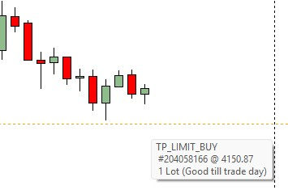
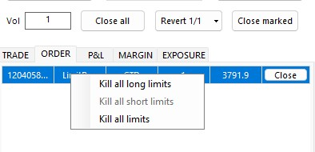

<a href="../.." title="MetaTrader-Panel" aria-label="MetaTrader-Panel">
<svg class="mobile_only" width="60" height="60" viewbox="0 0 40 40" xmlns="http://www.w3.org/2000/svg">
  <circle cx="20" cy="20" fill="none" r="12" stroke="#1750AC" stroke-width="3">
	<animate attributeName="r" from="8" to="20" dur="1.5s" begin="0s" repeatCount="indefinite"/>
	<animate attributeName="opacity" from="1" to="0" dur="1.5s" begin="0s" repeatCount="indefinite"/>
  </circle>
  <circle cx="20" cy="20" fill="#3373C4" r="13"/>
  <circle cx="20" cy="20" fill="#5494DA" r="12"/>
  <circle cx="20" cy="20" fill="#1750AC" r="8"/>
  <circle cx="20" cy="20" fill="#F5F5F5" r="7"/>
</svg>
</a>

# ORDER QUESTIONS

### Common	 	 

??? note "Why use orders at all?"

    While 20 years ago, securities trading was still largely telephone-based, today it is all about milliseconds. The following overview shows you just how big the differences really are.  
	
	| METHOD |                             |    DURATION                  |
	| :----------     | :-------------------------- |:---------------------------|
	| __`MetaTrader-Panel Limit Order`__     | |2-5 milliseconds|
	| __`Market order MT5`__ | |3-5 seconds  |
	| __`Telephone order`__  ||7-15 seconds |  
	
	Compared to a market order, your speed advantage with a limit order is up to a factor of 1000.

    
	
??? note "What's a GTC and what's a GTD order?"

    __`GTC`__ is the abbreviation for ‘Good until canceled’ and defines a limit order that remains active until it is either executed or the user cancels the order.  
	__`GTD`__ is the abbreviation for ‘Good until today’ and defines a limit order that expires at the end of the trading day if the limit price is not reached. 
	
	We recommend using the __`GTD`__  setting.
	
	
	
### Placing, changing, and deleting orders
??? note "How do I place an order?"

    You can place a limit order in a flash by double-clicking on the chart.  
	For a long limit order, double-click below the current price; for a short order, double-click above the current price.
	
	| ORDER TYPE            |                             |    ACTION                  |
	| :----------     | :-------------------------- |:---------------------------|
	| __`Long order`__     |    							|Double-click in an area lower than the current price|
	| __`Short order`__     |    							|Double-click in an area higher than the current price|
	
??? note "Can I also place orders from the tick chart?"

    Of course. The same principle applies as when placing a limit order in the MT5 chart.
	
??? note "Why can't I place an order?"
	
	There may be the following reasons for this:
	
    1. No trading is currently taking place.
	2. The option __`Allow algorithmic trading`__ in the MT5 options is not set.
	3. The difference between the limit price and the current price is smaller than the spread of the instrument.
	3. The MetaTrader panel interface displays a closed lock.
	4. Your broker is currently not allowing new positions for this instrument.
	 
	 

??? note "How do I change an order?"

    You can change your limit in a flash by simply moving the limit order to the new value with your mouse.
	
       
	
	:material-lightbulb-on:{ .lightbulb }  Tip: You can also change multiple orders that you have previously selected in the chart at once.
	 

??? note "How do I cancel an order?"
	
	By right-clicking in the Order Tab, you can either delete the selected limit or all set limits.
	
      
	
	:material-lightbulb-on:{ .lightbulb }  Tip: You can also delete an order by simply deleting the limit line in the MT5 chart.
 

 
 	
 
 
 