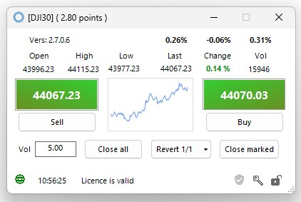
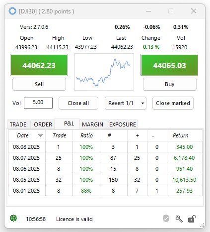

<a href="../.." title="MetaTrader-Panel" aria-label="MetaTrader-Panel">
<svg class="mobile_only" width="60" height="60" viewbox="0 0 40 40" xmlns="http://www.w3.org/2000/svg">
  <circle cx="20" cy="20" fill="none" r="12" stroke="#1750AC" stroke-width="3">
	<animate attributeName="r" from="8" to="20" dur="1.5s" begin="0s" repeatCount="indefinite"/>
	<animate attributeName="opacity" from="1" to="0" dur="1.5s" begin="0s" repeatCount="indefinite"/>
  </circle>
  <circle cx="20" cy="20" fill="#3373C4" r="13"/>
  <circle cx="20" cy="20" fill="#5494DA" r="12"/>
  <circle cx="20" cy="20" fill="#1750AC" r="8"/>
  <circle cx="20" cy="20" fill="#F5F5F5" r="7"/>
</svg>
</a>

# INTERFACE QUESTIONS 

### Miscellaneous	 	 
??? note "Why nothing happens when I click on buy or sell?" 

	
	<picture >
		
    <picture>  
	
	Check whether the __`lock`__  is open. If closed open it with a mouse click or use the keyboard shortcut __`Ctrl + L`__.
	
	:material-lightbulb-on:{ .lightbulb }  Tip: The lock is a protective feature that prevents you from accidentally triggering a trade.
	
??? note "Can I change the size of the interface?"
	
	You can continuously adjust the height of the interface with the mouse.
	
      
	Minimum size
	
	  
	Custom Größe 
	 
	:material-lightbulb-on:{ .lightbulb }  Tip: Double-click on the status bar to quickly minimize the interface.
	
??? note "Why there is more than one close button?"

	To enable you to react quickly to market situations, MetaTrader Panel features specialized close buttons.  
	The following overview demonstrates their usage.
	
    | Button            |   Usage                         |
	| :----------     | :----------------------------------- |
	| __`Close all`__    |Closes all positions of the instrument which are not marked as [__`Longrunner`__](pl-faq.md).
	| __`Close marked`__   |Closes all __selected__ positions of the instrument that are not marked as [__`Longrunner`__](pl-faq.md). |
	| __`Close`__      |Closes a single position or triggers a partial sale of the position.  |
	 

??? note "What is the Revert button for?"
	
    The __`Revert Button`__ allows you to close a position in a flash and open a position in the opposite direction.  
	You can decide whether to use the same position size or only a subset.  
	Detailed instructions on how to use the __`Revert Button`__ can be found [__here__](pl-faq.md).

	
??? note "How do I switch from the profit & loss display to the mini chart?"

    Double-click on the mini chart to switch to the profit & loss display or back again.  
    You can also use the keyboard shortcut   __`Ctrl +  C`__  .
	
??? note "How do I display the properties of a position?"

	Double-click on the position to easily open the properties dialog.
	

	

	<picture >
            
    <picture>  

	<picture >
            
    <picture>
		  
	

	
??? note "How can I view the trading hours for an instrument?"

	We've already taken care of that for you.
	
	<picture >
            
    <picture>   
	The display is structured like a timer. When the display shows __`00:00:00`__, trading has closed. To provide you with additional support, additional warnings are displayed during the __`last 15 minutes`__ before trading closes.
	
??? note "How can I view detailed trading results for a single day?"

    We explain this [__here__](pl-faq.md)	
	
??? note "What does docked mean?"

    You can run the MetaTrader Panel interface either in the main MT5 window or outside of it, whichever you prefer.
	In __`Docked Mode`__, the interface is part of MT5; otherwise, you can position the interface freely on your screen.

??? note "What do the various icons in the status bar mean?"

    We explain the meaning of the different icons and their usage [__here__](pl-faq.md).

 
### Position size	 	 
??? note "Do I have to use a period or comma as the decimal separator?"

    You can use either. Your input will be checked automatically and the decimal point replaced if necessary.

??? note "What if I make a mistake when entering the information?"

    If you enter an invalid value, this will be detected and the smallest possible lot size for the instrument will be suggested instead.

??? note "How do I determine the minimum position size for an instrument?"

    Simply enter a __`0`__, and the algorithm will replace this value with the smallest lot size possible for the selected instrument.    
	 	 

??? note "Can I set a maximum position size?"

    Yes, of course. To protect yourself from so-called “fat finger trades,” you can set both a warning threshold and a maximum position size in the MetaTrader panel options, regardless of your broker's specifications.
	You can find more information on this topic [__here__](pl-faq.md).

 

 
 	
 
 
 
