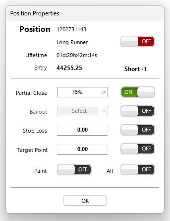
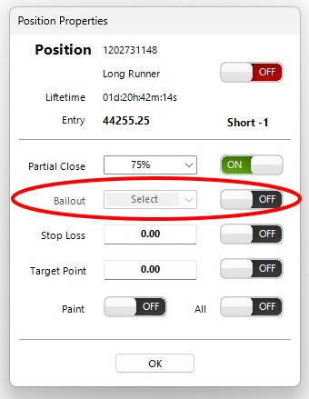

<a href="../.." title="MetaTrader-Panel" aria-label="MetaTrader-Panel">
<svg class="mobile_only" width="60" height="60" viewbox="0 0 40 40" xmlns="http://www.w3.org/2000/svg">
  <circle cx="20" cy="20" fill="none" r="12" stroke="#1750AC" stroke-width="3">
	<animate attributeName="r" from="8" to="20" dur="1.5s" begin="0s" repeatCount="indefinite"/>
	<animate attributeName="opacity" from="1" to="0" dur="1.5s" begin="0s" repeatCount="indefinite"/>
  </circle>
  <circle cx="20" cy="20" fill="#3373C4" r="13"/>
  <circle cx="20" cy="20" fill="#5494DA" r="12"/>
  <circle cx="20" cy="20" fill="#1750AC" r="8"/>
  <circle cx="20" cy="20" fill="#F5F5F5" r="7"/>
</svg>
</a>

# STOP QUESTIONS

## Common

??? note "What exactly are the differences between the various stops?"
    	
	

	
	The MetaTrader panel provides you with specialized stops that all work in <a href="../../features/stops#stealth-modus"><strong>stealth mode</strong></a>.  
	Below you will find an overview of which stop to use for what.
	

    | TYPW            | USAGE                           | STEALTH MODE                          |
	| :----------     | :----------------------------------- |:-----------------------------------: |
	| __`STOP LOSS`__     | Standard loss limitation|:material-check:  |
	| __`TARGET POINT`__       | Standard profit protection |:material-check:  |
	| __`BAILOUT`__    		   | Quickly closing bad entries |:material-check:  |
	| __`GROUP STOP`__         | Loss limitation for all positions of an instrument |:material-check: |
	| __`GUARDIAN ANGEL`__     | Loss limitation for all positions across all instruments |:material-check:  |
	| __`LONGRUNNER`__         | Defines exception rules |:material-check:  |
	
	

	
	
You can find detailed information about the different stops <a href="../../features/stops/"><strong>here</strong></a>

    
??? note "What is Stealth Mode?"

    
In Stealth Mode, your stops are hidden from your broker and only you can see them. More information about Stealth Mode and why it is so important you can find <a href="../../features/stops/"><strong>here</strong></a>

		  
	
??? note "I want to set a stop. How do I do that?"

	Double-click on the position whose properties you want to change to easily open the Properties dialog box.  
		
    :material-lightbulb-on:{ .lightbulb }  Tip: Make sure the lock is open.

	

	<picture >
            
    <picture>  
	
	In the Properties dialog, you can now set your stops as desired.
    

	<picture >
            
    <picture>
		  
	

	
You can find more information about the different stops  <a href="../../features/stops/"><strong>here</strong></a>

??? note "Can I set stops before opening a position?"
	
	Yes, of course, that's no problem. In the MetaTrader panel settings, you can set both a stop loss and a target point value for the respective instrument, which are valid immediately upon opening the position.
	
	

	<picture >
            
    <picture>
    
	
For more information on predefined stops, see <a href="../../features/stops/"><strong>here</strong></a>

		  
	

 
     
 	
## Stop Loss

??? note "How do I set a stop loss?"
	
	Double-clicking on a position in the interface displays its properties.
	
      
	
??? note "Can my broker see my stop loss?"

    No, don't worry. MetaTrader Panel works in what is known as  __`Steahlth Mode`__.
	All stops are hidden from your broker, and only you know where they are.
	
??? note "What is the fastest way to secure a position once it becomes profitable?"

    Simply hold down the __`Ctrl key`__  and double-click on the position in the interface to set a stop loss in the money. You can specify how far in the money the stop loss is set in the instrument options.

??? note "What's the fastest way to change a stop loss?"

    By far the fastest way to change your stop loss is to simply drag it to where you want it in the MT5 chart.  
	You can also change the stop loss via the position properties.

??? note "I want to set the same stop loss for all positions."

    No problem, just activate the __`All`__ switch in the position properties. The algorithm will then apply the suggested value to all open positions for which the same stop loss is possible.
	Positions where the suggested value would result in the immediate closure of the position are ignored.

??? note "Can I display the stop loss on the chart?"

    Sure. Just activate the switch in the position properties. __`Paint`__ .	 
	
??? note "Can I combine a stop loss with a partial sale?"

    No problem for MetaTrader Panel. Simply activate the __`Partial sale`__ with the desired percentage. In addition, you set your stop loss as usual.
 
## Target Point	 	 

??? note "How do I set a target point?"

    Double-clicking on a position in the interface displays its properties.
	
      .

??? note "Can my broker see my target point?"

    No, don't worry. MetaTrader Panel works in what is known as __`Steahlth Mmde`__.
	All stops are hidden from your broker, and only you know where they are.
	 
	 
??? note "What is the fastest way to change a target point?"

    Once you have drawn the target point in the MT5 chart, you can simply move the line to the new value with the mouse.
	 
??? note "I want to set the same stop loss for all positions."

    No problem, just activate the __`All`__ switch in the position properties. The algorithm will then apply the suggested value to all open positions for which the same stop loss is possible.  
	Positions where the suggested value would result in the immediate closure of the position are ignored.
	
??? note "Can I display the target point on the chart?"

    Simply activate the __`Paint`__ switch in the position properties and your target point will be drawn on the chart.
	
??? note "Can I combine the Target Point with a partial sale?"

    No problem for MetaTrader Panel. Simply activate the __`Partial sale`__ with the desired percentage. In addition, you set your target point as usual.     .
 
## Bailout

??? note "What exactly is a bailout and how do I use it?"
	
	Sometimes a trade does not go as planned. In such cases, it is often best to close the position at break-even if possible.
	The __`Bailout`__ function supports you in doing so. You define a distance from your entry price and the Bailout function closes the position for you as soon as that range is reached.
	You can find more information at [__here__](../features/stops.md)

??? note "How do I activate the bailout?"
	
	Activate the __`Bailout`__ switch and set the desired spread multiplier. That's it.
	
      .

??? note "Why can't I activate the bailout?"

    The bailout can only be activated for positions that are out of the money.  
	If your position is profitable, there is no reason to use the bailout.

??? note "Can I set the bailout for all open positions at the same time?"

    No, that wouldn't make sense. The bailout must be activated specifically for each position.
 

## Group Stop 	 

??? note "What exactly is a group stop?"

    You can think of a group stop as similar to a stop loss, except that a group stop takes into account all positions of an instrument.  
	You can find more information about stops [__here__](../features/stops.md)

??? note "Will all positions be closed if the group stop is triggered?"

    No, when the Group Stop is triggered, it searches for the position of the instrument with the greatest loss and closes it.  
	This process is repeated every time the specified loss limit is exceeded.	
	 
??? note "Can I use the Group Stop in conjunction with a Position Stop Loss?"

    Yes, of course, that way you are doubly covered.
	 
??? note "Can I use the Group Stop in conjunction with a position target point?"

    Of course, the same principle applies as when combining with a stop loss.
	
??? note "Is a Group Stop defined in points?"

    No, you set the group stop value in the currency of your trading account.
	 	 
 
## Guardian Angel

??? note "What is the Guardian Angel feature and how do I use it?"

    You can think of the Guardian Angel Stop as similar to a stop loss, except that the Guardian Angel Stop takes into account all positions and all instruments. You can find more information about stops here.

??? note "Are all positions closed when the guardian angel stop is triggered?"

    No, when the guardian angel stop is triggered, it searches all instruments for which you have an open position for the one with the highest loss and closes only that one.  
	This process is repeated every time the specified loss limit is exceeded.

??? note "Can I use the guardian angel in conjunction with a group stop?"

    Yes, of course, all stops build on each other and complement each other.  
	You can find more information about how the stops interact with each other [__here__](../features/stops.md)

??? note "Can I use the Guardian Angel in conjunction with a position's stop loss or target point?"

	Yes, of course, no problem, all stops can be combined with each other.
	[__Here__](../features/stops.md) we explain the different stops in detail.

??? note "Is the Guardian Angel Stop set in points?"

    No, you set the stop value in the currency of your trading account.
 	
## Longrunner

??? note "What exactly is a long runner?"

    The __`Longrunner`__ status defines exception rules for a position. This allows you to trade short- and medium-term trades in parallel.
	Below you will find an overview of the rules.
	
	- Not taken into account when using __`Close all`_
	- Not included in  __`P&L display`__
	- Not taken into account when usingi __`Close marked`__ 
	- Not taken into account when using __`Revert`__ 
	- Closed last when __`Group Stop`__ is triggered
	- Closd last when __`Guardian angel`__  is triggered
	 
	
 
 
 	
 
 
 
