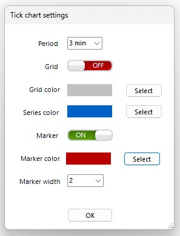

<a href="../.." title="MetaTrader-Panel" aria-label="MetaTrader-Panel">
<svg class="mobile_only" width="60" height="60" viewbox="0 0 40 40" xmlns="http://www.w3.org/2000/svg">
  <circle cx="20" cy="20" fill="none" r="12" stroke="#1750AC" stroke-width="3">
	<animate attributeName="r" from="8" to="20" dur="1.5s" begin="0s" repeatCount="indefinite"/>
	<animate attributeName="opacity" from="1" to="0" dur="1.5s" begin="0s" repeatCount="indefinite"/>
  </circle>
  <circle cx="20" cy="20" fill="#3373C4" r="13"/>
  <circle cx="20" cy="20" fill="#5494DA" r="12"/>
  <circle cx="20" cy="20" fill="#1750AC" r="8"/>
  <circle cx="20" cy="20" fill="#F5F5F5" r="7"/>
</svg>
</a>

# TICK CHART QUESTIONS

### Common	 	 

??? note "Does the tick chart use bid or ask?"

    That's up to you. Depending on what you want to use for your trades, activate either Bid or Ask.
	
??? note "Are timeframes available for the tick chart?"

    Yes, of course, you can choose intervals between 1 minute and 60 minutes.

??? note "How do I store the tick chart screen position?"

    We'll take care of that for you. The position of the tick chart is saved automatically.

??? note "Can I define my own settings?"

	Of course. Configure the tick chart however you like; you can find the settings for this in the tick chart settings. When you open the tick chart, your settings will be loaded automatically. 
	
	   
	
	:material-lightbulb-on:{ .lightbulb }  Tip: You can open the settings by clicking on the wrench icon.

??? note "Can I place orders?"

    Of course, you can place an order. We explain exactly how to do this, and how to change or delete an order, in the order questions below.

??? note "Can I place a stop loss?"

    Of course, you can also set a stop loss for an open position. We explain how to do this and how to change the stop in the stop loss questions below.

??? note "Can I place a target point?"

	In high-requency trading, the old adage “cut losses short, let profits run” applies more than in any other type of trading. 
	If you are actively trading on the tick chart, you should not need a target point.
 
	
### Placing, modifying and deleting orders
??? note "How do I place an order?"

    You can place a limit order in a flash by double-clicking on the chart.  
	To place a long limit order, double-click below the current price; for a short order, double-click above the current price.
	
	| ORDER TYPE            |                             |    ACTION                  |
	| :----------     | :-------------------------- |:---------------------------|
	| __`Long order`__     |    							|Double-click in an area lower than the current price|
	| __`Short order`__     |    							|Double-click in an area higher than the current price|

??? note "How do I modify an order?"

    The quickest way to change your limit is to simply move the limit order to the new value with your mouse.
	
??? note "How do I delete an order?"

    Right-click the order and select the delete command.
	
??? note "I can't place an order"

    There may be the following reasons for this:  
	
    1. No trading is currently taking place.
	2. The option __`Allow algorithmic trading`__ in the MT5 options is not set.
	3. The difference between the limit price and the current price is smaller than the spread of the instrument.
	3. The MetaTrader panel interface displays a closed lock.
	4. Your broker is currently not allowing new positions for the instrument.
	
 

### Placing, modifying and deleting a stop loss
??? note "How do I place a stop loss?"

    Simply hold down the __`Ctrl key`__  and double-click on the position in the interface
    to set a stop loss in the money. You can individually specify how far in the money the stop loss is set 
    in the instrument options..
	
??? note "How do I modify a stop loss?"

    By far the fastest way to change your stop loss is to simply draw the line in the tick chart where you want the new stop loss to be.  
	You can also change the stop loss via the position properties.
	
??? note "How do I delete a stop loss?"

       You can delete the selected stop by right-clicking on the chart.

??? note "I can't place a stop loss"

    There may be the following reasons for this:  
	
    1. No trading is currently taking place.
	2. The option __`Allow algorithmic trading`__ in the MT5 options is not set.
	3. The difference between the stop loss and the current price is smaller than the spread of the instrument.
	3. The MetaTrader panel interface displays a closed lock.

	
 
 	
 
 
 