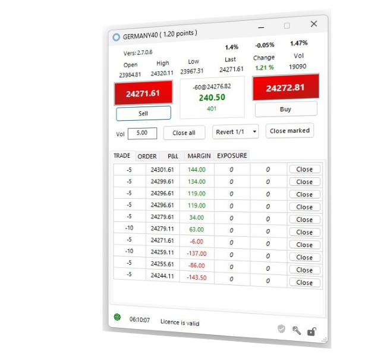

---
hide:
- navigation
---

   

      

         <svg class="mobile_only" width="60" height="60" viewbox="0 0 40 40" xmlns="http://www.w3.org/2000/svg">
            <circle cx="20" cy="20" fill="none" r="12" stroke="#1750AC" stroke-width="3">
               <animate attributeName="r" from="8" to="20" dur="1.5s" begin="0s" repeatCount="indefinite"/>
               <animate attributeName="opacity" from="1" to="0" dur="1.5s" begin="0s" repeatCount="indefinite"/>
            </circle>
            <circle cx="20" cy="20" fill="#3373C4" r="13"/>
            <circle cx="20" cy="20" fill="#5494DA" r="12"/>
            <circle cx="20" cy="20" fill="#1750AC" r="8"/>
            <circle cx="20" cy="20" fill="#F5F5F5" r="7"/>
         </svg>
         <h1 id="refresh-headertext" style="font-size:30px;">YOU FOCUS ON TRADES, LET US TAKE CARE FOR THE REST</h1>
         <h2 id="refresh-subtext" style="color: #333333;font-size:25px;">Trading successfully is difficult enough. You shouldn't distract yourself with trivial things. We make yourt trading more successful.</h2>
         <h3 style="color: #808080;">Give it a go and test us, it's free.</h3>
      

      <!--Call to Action-->
      <a id="learn-more" href="#" class="button" style="background-color: #5494DA;color:white;">Learn more <iclass="fa fa-play" aria-hidden="true"></i></a>
      <!--End Call to Action-->
   

   

      

         <picture >
            
         </picture>
      

   

<!--Main Content Area-->

   <!--Introduction-->
   <section id="about" class="introduction ">
      

         

			

               <h3>SUCCESS</h3>
               <h2 class="section-title">How we help to achieve better trading results</h2>
               
Well-thought-out features, developed by professional traders with decades of experience, integrate seamlessly into MT5
				  making your everyday life as a trader easier. With just one or two clicks, you always have the functionality you need at your fingertips. Compact and focused on the essentials. 
				    
<a href="features/" style="color: #5494DA"><strong>See all features</strong> </a>
 
              
               

            

         

         

            <!--Icon Block-->
            

               <!--Icon-->
               

                  <i class="fa fa-star fa-2x" style="color: #5494DA;"></i>
               

               <!--Icon Block Description-->
               

                  <h4></i>Economic calendar</h4>
                  
Never miss important economic data again. Simply configure countries, categories, and time once, and you will always be reliably informed.
                  

               

            

            <!--End of Icon Block-->
            <!--Icon Block-->
            

               <!--Icon-->
               

                  <i class="fa fa-trophy fa-2x" style="color: #5494DA;"></i>
               

               <!--Icon Block Description-->
               

                  <h4>Partial sale</h4>
                  
Increase your profit and sell a position in percentage increments. Combine partial sales with your stop loss or target point.
                  

               

            

            <!--End of Icon Block-->
         

         

            <!--Icon Block-->
            

               <!--Icon-->
               

                  <i class="fa fa-flag-checkered fa-2x" style="color: #5494DA;"></i>
               

               <!--Icon Block Description-->
               

                  <h4>Double-click orders </h4>
                  
Place, delete, or change an order with a single click. The secret to a successful entry is being in the right place at the right time.
                  

               

            

            <!--End of Icon Block-->
            <!--Icon Block-->
            

               <!--Icon-->
               

                  <i class="fa fa-rocket fa-2x" style="color: #5494DA;"></i>
               

               <!--Icon Block Description-->
               

                  <h4>Stops in no time</h4>
                  
Secure your position against losses with a single click as soon as a position becomes profitable. Change the stop with a click of the mouse.
                  

               

            

            <!--End of Icon Block-->
         

		 

            <!--Icon Block-->
            

               <!--Icon-->
               

                  <i class="fa fa-bolt fa-2x" style="color: #5494DA;"></i>
               

               <!--Icon Block Description-->
               

                  <h4>Tick chart trading</h4>
                  
Whether you are a professional scalper, swing trader, or retail trader who just wants to seize the moment, you will love the tick chart.
                  

               

            

            <!--End of Icon Block-->
            <!--Icon Block-->
            

               <!--Icon-->
               

                  <i class="fa fa-bullseye fa-2x" style="color: #5494DA;"></i>
               

               <!--Icon Block Description-->
               

                  <h4>Fibonacci power</h4>
                  
Calculate hundreds of Fibonacci levels over long periods of time and only display those that are relevant to your trading.
                  

               

            

            <!--End of Icon Block-->
         

      

   </section>
   <!--End of Introduction-->
   <!--Content Section-->
   

      

         <!--Content Left Side-->
         

            <!--User Testimonial-->
            <blockquote class="testimonial text-right font-18">
               <q class="font-18">Games are won by players who focus on the playing field –- not by those whose eyes are glued to the scoreboard.</q>
               <footer class="font-17">— Warren Buffet —</footer>
            </blockquote>
            <!-- End of Testimonial-->
         

         <!--End Content Left Side-->
         <!--Content of the Right Side-->
         

            

               <h3>FOCAL POINT</h3>
               <h2 class="section-title">Focus on what's essential</h2>
               
You take care of the game and we'll take care of the scoreboard.

            

            
Nowadays in active trading milliseconds often make all the difference. Having the right information at the right time is crucial to your success as a trader. 
            

            

               With intelligent algorithms, parallel data processing, powerful state-of-the-art servers, and a trading desk that you will love for its clarity and simplicity, we keep your back free.
            

			
<a href="features/" style="color: #5494DA"><strong>See all features</strong> </a>

         

         <!--End Content Right Side-->
         

            
         

      

   

   <!--End of Content Section-->
   

      
 

   

   <!--Pricing Tables-->
   <section id="pricing" class="secondary-color text-center clearfix wow fadeInRight" data-wow-delay="0.1s"">
      

         

            <h3>YOUR DECISION</h3>
            <h2 class="section-title" >We got the right package for you</h2>
         

         <!--Pricing Block-->
         

            

               <h3>STARTER</h3>
               
Risk-free trial

               

                  
€0.0

                  
Test MetaTrader Panel at your leisure and practice trading

               

               <ul class="font-17">
                  <li style="color: #333333;">Great for beginners</li>
                  <li style="color: #333333;">2 Trading Panels</li>
                  <li style="color: #333333;">Valid for 3 Months</li>
                  <li style="color: #333333;">Demo account only</li>
                  <li style="color: #333333;">Restricted support</li>
               </ul>
               <a href="#" class="button" style="background-color: #5494DA;color:white;font-weight: bold;">FREE TRIAL</a>
            

         

         <!--End Pricing Block-->
         <!--Pricing Block-->
         

            

               <h3>ADVANCED</h3>
               
Day trading

               

                  
€9.90

                  
Everything you need for successful intraday trading

               

               <ul  class="font-17">
                  <li>Day trader / scalper</li>
                  <li>Unlimited panels</li>
                  <li>Trading knowledgebase</li>
                  <li>12 months of updates included</li>
                  <li>Full support</li>
               </ul>
               <a href="#" class="button" style="background-color: #5494DA;color:white;font-weight: bold;">BUY NOW </a>
            

         

         <!--End Pricing Block-->
         <!--Pricing Block-->
         

            

               <h3>PROFESSIONAL</h3>
               
Day trading plus signals

               

                  
€29.90

                  
Additional trading signals from our AI “Jeannie”"

               

               <ul  class="font-17">
                  <li>AI trading signals</li>
                  <li>Unlimited panels</li>
                  <li>Trading knowledgebase</li>
                  <li>12 months of updates included</li>
                  <li>Full support</li>
               </ul>
               <a href="#" class="button" style="background-color: #5494DA;color:white;font-weight: bold;">BUY NOW </a>
            

         

         <!--End Pricing Block-->
      

   </section>
   <!--End of Pricing Tables-->
   <!--Testimonials-->
   <aside id="testimonials" class="text-center wow fadeInUp" data-wow-delay="0.1s"">
      

         

            <h3>FEEDBACK</h3>
            <h2 class="section-title">What our customers say</h2>
         

         <!--User Testimonial-->
         <blockquote  id="ttm1" class="col-3 testimonial classic">
            <q id="ttm1">This is such a wonderful tool shared with generosity. Thank you! Wonderful job. I aim at going full version, using this one for training.</q>
         </blockquote>
         <!-- End of Testimonial-->
         <!--User Testimonial-->
         <blockquote  id="ttm2" class="col-3 testimonial classic">
            <q >Lorem ipsum dolor sit amet, consectetur adipiscing elit, sed do eiusmod tempor incididunt ut
            labore et dolore magna aliqua</q>
         </blockquote>
         <!-- End of Testimonial-->
         <!--User Testimonial-->
         <blockquote id="ttm3" class="col-3 testimonial classic">
            <q >Lorem ipsum dolor sit amet, consectetur adipiscing elit, sed do eiusmod tempor incididunt ut
            labore
            et dolore magna aliqua</q>
         </blockquote>
         <!-- End of Testimonial-->
      

   </aside>
   <!--End of Testimonials-->	

<!--End Main Content Area-->
